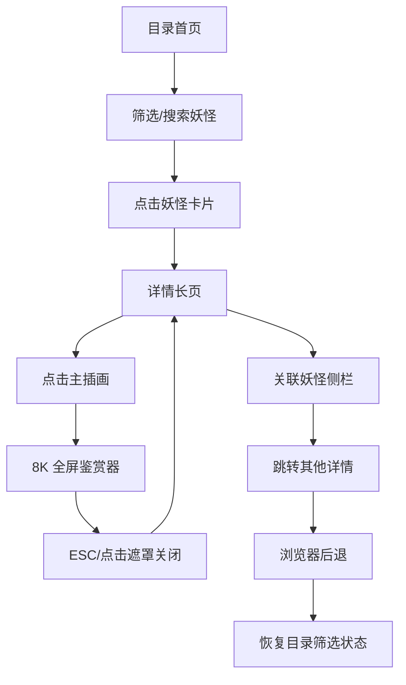

## 1. 产品概述
「万象妖典·妖灵档案室」是一款妖怪文化知识档案系统，为用户提供妖怪个体详情的沉浸式浏览体验。以瑞士风格长卷轴式单页呈现，融合古籍美学与现代交互设计。
- 主要目标：为妖怪文化爱好者提供结构化、可视化的妖怪传说知识库
- 核心价值：将散落的妖怪传说系统化呈现，通过丰富的交互设计激发探索兴趣

## 2. 核心功能

### 2.2 功能模块
1. **目录首页**：妖怪卡片列表、多维度筛选、搜索功能
2. **详情长页**：左侧固定信息栏、右侧章节式内容区（传说起源、能力特质、出没地域、古籍原文、目击记录）
3. **8K 插画鉴赏器**：全屏模式、缩放平移、8K 切片加载
4. **关联妖怪侧栏**：横向滑动的关联推荐卡片

### 2.3 页面详情
| 页面名称 | 模块名称 | 功能描述 |
|-----------|-------------|---------------------|
| 目录首页 | 筛选导航栏 | 特章筛选、地域筛选、危险等级筛选、搜索框 |
| 目录首页 | 妖怪卡片列表 | 网格布局卡片、悬浮动效、点击跳转详情 |
| 详情长页 | 左侧固定信息栏 | 名称、学名、地域、危险等级、快速导航锚点 |
| 详情长页 | 传说起源模块 | 垂直时间轴、朝代/文献节点、展开原文与白话释义 |
| 详情长页 | 能力特质模块 | 五维雷达图、悬停释义、佚失维度标注 |
| 详情长页 | 出没地域模块 | 地域分布图、出没时间、栖息环境 |
| 详情长页 | 古籍原文模块 | 原文摘录、出处标注、来源待考水印 |
| 详情长页 | 目击记录模块 | 时间倒序排列、日期地点可信度、传闻类半透明处理 |
| 8K 鉴赏器 | 全屏浮层 | 0.5×–4× 缩放、拖拽平移、8K 切片切换、ESC 关闭、滚动位置恢复 |
| 关联侧栏 | 推荐卡片 | 同特章/同地域/传说交集妖怪、横向滑动、最多 8 条 |

## 3. 核心流程
用户从目录首页通过筛选或浏览找到感兴趣的妖怪卡片，点击进入详情长页。在详情页可通过左侧锚点快速导航各章节，浏览传说起源时间轴、查看能力雷达图、阅读古籍原文与目击记录。点击主插画进入 8K 全屏鉴赏模式，支持缩放与拖拽。右侧或底部的关联妖怪侧栏可横向滑动浏览并跳转至其他妖怪详情。点击浏览器后退按钮可返回目录页，并恢复之前的筛选状态。

## 4. 用户界面设计
### 4.1 设计风格
- **主色调**：深墨色 `#1a1a14` 为底，仿古绢黄 `#f5e6c8` 为文色，朱砂红 `#c8323c` 为点缀，青铜绿 `#5c7a6b` 为次级色
- **按钮风格**：圆角微方，仿印章朱红按压反馈，边框双细线
- **字体**：标题使用「方正清刻本悦宋」或「思源宋体 Heavy」，正文使用「思源宋体 Regular」，古籍原文使用楷体
- **布局风格**：瑞士风格长卷轴，左侧 320px 固定信息栏，右侧自适应主内容区
- **视觉特效**：雾效遮罩渐变、卷轴纹理背景、宣纸噪点、古书折痕阴影

### 4.2 页面设计概述
| 页面名称 | 模块名称 | UI 元素 |
|-----------|-------------|-------------|
| 目录首页 | 筛选导航栏 | 水墨晕染背景、朱红印章式筛选标签、宋体大标题 |
| 目录首页 | 妖怪卡片 | 绢纹卡片底、悬浮微抬升、边缘渐隐雾效 |
| 详情长页 | 左侧信息栏 | 竖排古籍标题、朱砂危险等级章、快速导航圆点 |
| 详情长页 | 传说起源 | 垂直绢本时间轴、青铜色节点、展开动画如卷轴展开 |
| 详情长页 | 能力特质 | 墨色晕染雷达图、悬停金粉粒子、佚失灰化处理 |
| 详情长页 | 古籍原文 | 米黄绢本背景、楷体竖排、出处朱印、来源待考水印 |
| 详情长页 | 目击记录 | 档案卡片样式、传闻半透明磨砂、可信度星标 |
| 8K 鉴赏器 | 全屏浮层 | 深黑遮罩、缩放控制条、8K 加载进度指示 |
| 关联侧栏 | 推荐卡片 | 横向滑动轨道、迷你卡片样式、关联关系标签 |

### 4.3 响应式
- 桌面端（>1280px）：左侧固定栏 320px + 右侧内容区，关联侧栏悬浮右侧
- 平板端（768-1280px）：左侧栏折叠为顶部信息卡，关联侧栏改为底部横滑区
- 移动端（<768px）：单列垂直布局，鉴赏器缩放上限 2×，触摸优化拖拽

### 4.4 动效设计
- 页面加载：卷轴从上至下展开动画，内容渐次显现
- 时间轴节点：点击时卷轴展开动画，高亮节点青铜光晕
- 雷达图：加载时墨色晕染扩散动画
- 卡片悬浮：微抬升 + 边缘雾效流动
- 鉴赏器：进入时插画渐显 + 控制条淡入
