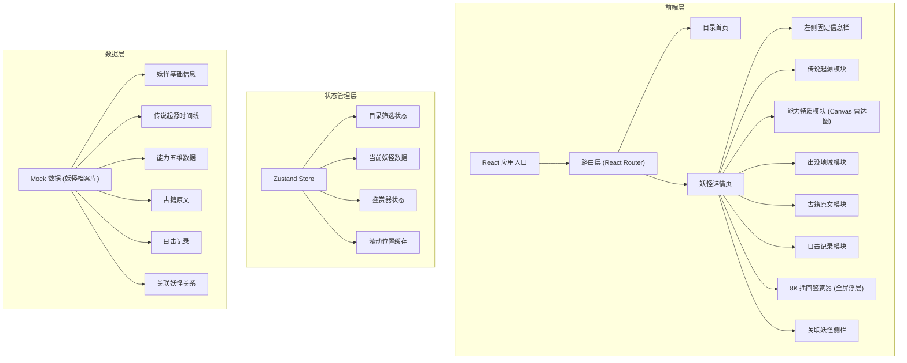
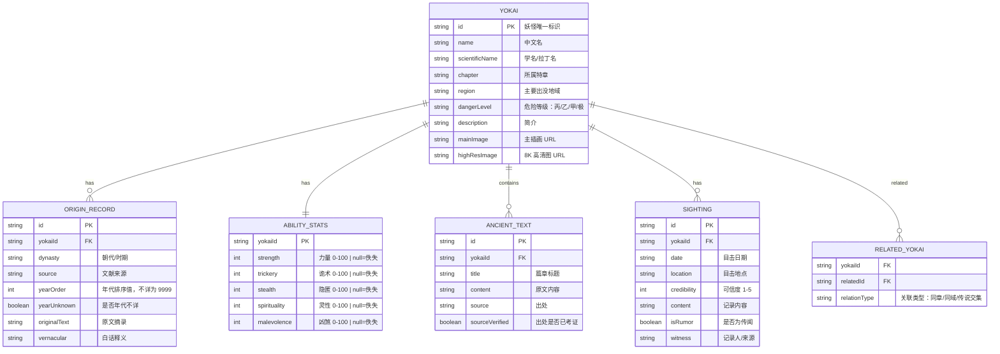

## 1. 架构设计



## 2. 技术描述
- **前端框架**：React@18 + TypeScript
- **构建工具**：Vite@5
- **样式方案**：TailwindCSS@3 + CSS 自定义属性（主题变量）
- **路由管理**：react-router-dom@6（含 state 传递筛选状态）
- **状态管理**：Zustand（轻量状态管理，持久化筛选状态）
- **图形渲染**：原生 Canvas API（雷达图，避免引入额外依赖）
- **拖拽缩放**：原生事件实现（8K 鉴赏器）
- **图标库**：lucide-react

## 3. 路由定义
| 路由 | 用途 |
|-------|---------|
| `/` | 目录首页：妖怪卡片列表 + 筛选导航 |
| `/yokai/:id` | 妖怪详情长页：固定栏 + 多模块内容 |

## 4. 数据模型

### 4.1 数据模型定义



### 4.2 Mock 数据
内置 10+ 妖怪档案（九尾狐、姑获鸟、般若、玉藻前、酒吞童子、猫又、河童、天狗、滑瓢、雪女），涵盖完整的传说起源、能力数据、古籍原文与目击记录。

## 5. 组件结构

```
src/
├── components/
│   ├── layout/
│   │   ├── SideInfoBar.tsx        # 左侧固定信息栏
│   │   └── SectionAnchor.tsx      # 章节锚点导航
│   ├── catalog/
│   │   ├── FilterBar.tsx          # 筛选导航栏
│   │   └── YokaiCard.tsx          # 妖怪卡片
│   ├── detail/
│   │   ├── LegendTimeline.tsx     # 传说起源时间轴
│   │   ├── AbilityRadar.tsx       # 能力雷达图
│   │   ├── HabitatMap.tsx         # 出没地域
│   │   ├── AncientTexts.tsx       # 古籍原文
│   │   └── SightingRecords.tsx    # 目击记录
│   ├── viewer/
│   │   └── HighResViewer.tsx      # 8K 鉴赏器
│   └── related/
│       └── RelatedSidebar.tsx     # 关联妖怪侧栏
├── pages/
│   ├── CatalogPage.tsx            # 目录首页
│   └── YokaiDetailPage.tsx        # 详情长页
├── store/
│   └── useYokaiStore.ts           # Zustand 状态
├── data/
│   └── yokaiData.ts               # Mock 数据
├── types/
│   └── yokai.ts                   # TypeScript 类型
├── hooks/
│   ├── useScrollPosition.ts       # 滚动位置管理
│   └── useImageZoom.ts            # 鉴赏器缩放拖拽
└── utils/
    └── canvasUtils.ts             # Canvas 绘图工具
```

## 6. 关键技术实现要点

### 6.1 浏览器后退状态恢复
- 路由跳转时将筛选状态存入 `location.state` 与 Zustand Store
- 返回目录页时优先从 `location.state` 读取，次选 Store 持久化值

### 6.2 8K 鉴赏器缩放
- 使用 CSS `transform: translate() scale()` 实现
- 双指捏合：监听 `touchmove` 计算两指距离变化
- 滚轮缩放：监听 `wheel` 事件，`ctrlKey` 时精确缩放
- 移动端上限 `maxScale = 2`，桌面端 `maxScale = 4`
- `scale >= 2` 时切换加载 8K 图片并显示加载指示

### 6.3 Canvas 雷达图
- 原生 Canvas 绘制五边形蛛网
- 各维度独立判断 `null` → 显示「佚失」
- 鼠标位置计算最近维度，显示释义 Tooltip

### 6.4 雾效与卷轴纹理
- 使用 CSS `mask-image: linear-gradient()` 实现边缘渐隐雾效
- SVG noise 滤镜 + `background-image` 实现宣纸/绢布纹理
- 多层半透明渐变叠加模拟古书折痕
